# Meteorology Flashcards - Weather Charts and Tools
## Questions MET-176 to MET-225

---

## MET-176
**Topic:** Meteorology - Weather Charts and Tools  
**Type:** Image Interpretation  
**Difficulty:** Basic  
**Tags:** surface-analysis, symbols, fronts

Using the chart symbols shown in the asset, what do the blue triangles on a frontal boundary represent?

**Answer:** A cold front.

**Explanation:** On surface analysis charts, a cold front is shown by a line with blue triangles pointing in the direction the front is moving. Cold fronts are often associated with wind shifts, pressure changes, turbulence, showers, and possible thunderstorms.

**Reference:** FAA Aviation Weather Handbook, Ch. 25, Surface Analysis Chart Symbols; NAV CANADA Aviation Weather Services Guide, Weather Charts

**Asset Source:** `references/FAA Weather.pdf`, Figure 25-6, NWS Surface Analysis Chart Symbols, extracted to `Questions/assets/MET-176_surface_analysis_symbols.png`

---

## MET-177
**Topic:** Meteorology - Weather Charts and Tools  
**Type:** Image Interpretation  
**Difficulty:** Basic  
**Tags:** surface-analysis, fronts, warm-front

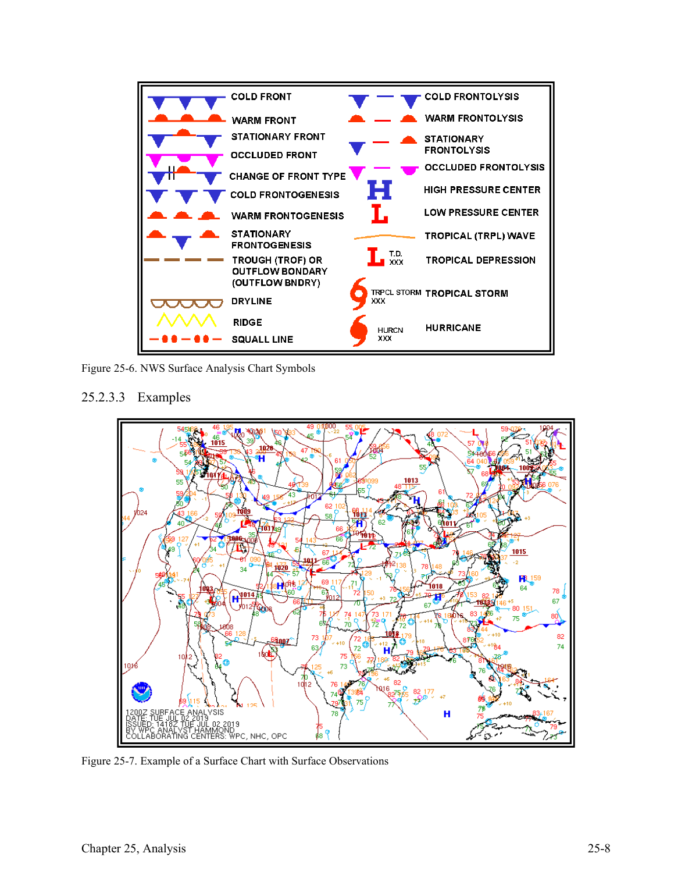

Using the chart symbols shown in the asset, what does a line with red semicircles represent?

**Answer:** A warm front.

**Explanation:** Warm fronts are commonly drawn with red semicircles pointing in the direction of movement. For pilots, warm fronts often mean widespread layered cloud, lowering ceilings, reduced visibility, steady precipitation, and possible icing in cold air.

**Reference:** FAA Aviation Weather Handbook, Ch. 25, Surface Analysis Chart Symbols

**Asset Source:** `references/FAA Weather.pdf`, Figure 25-6, NWS Surface Analysis Chart Symbols, extracted to `Questions/assets/MET-177_surface_analysis_front_symbols.png`

---

## MET-178
**Topic:** Meteorology - Weather Charts and Tools  
**Type:** Image Interpretation  
**Difficulty:** Intermediate  
**Tags:** surface-analysis, pressure-systems, isobars

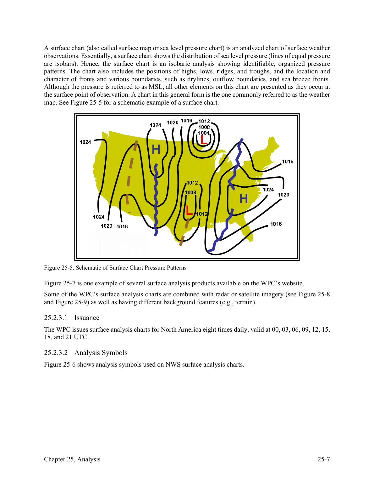

On a surface analysis chart, what do closely spaced isobars indicate?

**Answer:** A strong pressure gradient and therefore stronger winds.

**Explanation:** Isobars connect areas of equal pressure. When they are close together, pressure changes rapidly over a short distance, producing stronger wind. For VFR pilots, tight isobars suggest crosswind, mechanical turbulence, and enroute groundspeed concerns.

**Reference:** FAA Aviation Weather Handbook, Ch. 25, Surface Analysis Chart; NAV CANADA Aviation Weather Services Guide, Weather Charts

**Asset Source:** `references/FAA Weather.pdf`, Figure 25-7 discussion area, extracted to `Questions/assets/MET-178_surface_analysis_overview.png`

---

## MET-179
**Topic:** Meteorology - Weather Charts and Tools  
**Type:** Image Interpretation  
**Difficulty:** Intermediate  
**Tags:** station-plot, surface-analysis, decoding

In a station plot model, what weather information is normally shown by the wind barb attached to the station circle?

**Answer:** Wind direction and wind speed.

**Explanation:** The shaft of the wind barb points from the direction the wind is coming from, and the feathers or pennants show wind speed. This lets pilots quickly see surface wind patterns across a weather chart.

**Reference:** FAA Aviation Weather Handbook, Ch. 25, Station Plot Models

**Asset Source:** `references/FAA Weather.pdf`, Figure 25-10, NWS Surface Analysis Chart Station Plot Model, extracted to `Questions/assets/MET-179_station_plot_model.png`

---

## MET-180
**Topic:** Meteorology - Weather Charts and Tools  
**Type:** Image Interpretation  
**Difficulty:** Intermediate  
**Tags:** station-plot, pressure, decoding

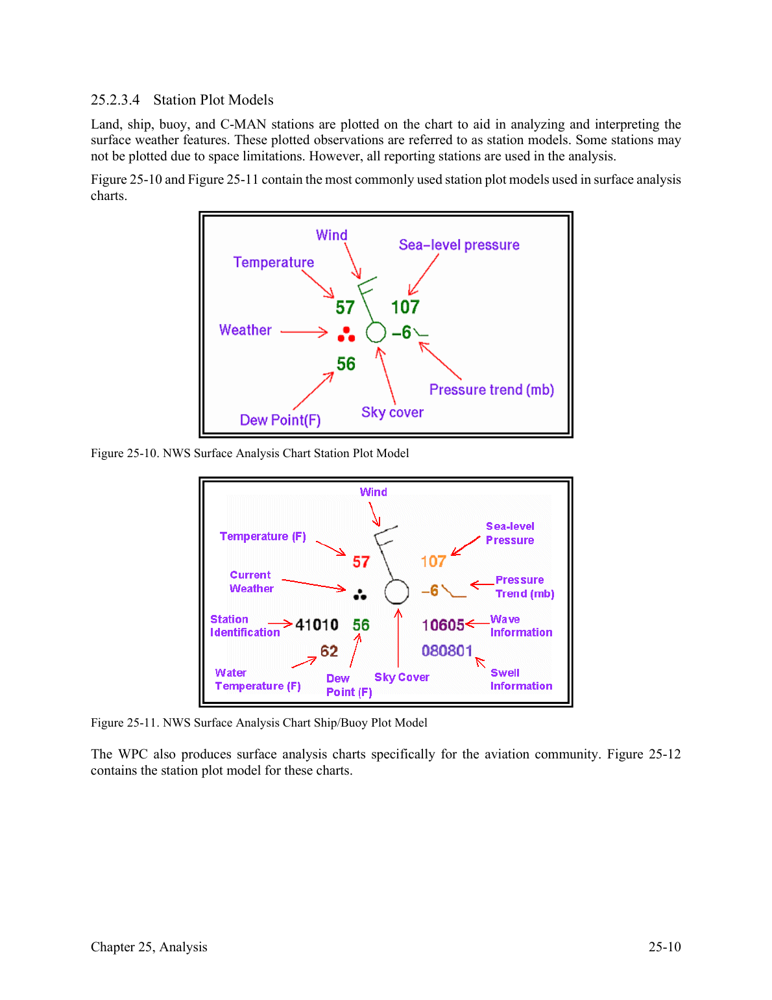

On a station plot, why is the sea level pressure often coded with only the last three digits?

**Answer:** To save space on the chart; the pilot must reconstruct the full pressure value by adding either 9 or 10 in front and placing the decimal before the last digit.

**Explanation:** A plotted pressure of `132` usually means 1013.2 hPa, while `982` usually means 998.2 hPa. Choose the value that gives a realistic sea level pressure.

**Reference:** FAA Aviation Weather Handbook, Ch. 25, Station Plot Models; NAV CANADA Aviation Weather Services Guide, METAR Sea Level Pressure Remarks

**Asset Source:** `references/FAA Weather.pdf`, Figure 25-10, NWS Surface Analysis Chart Station Plot Model, extracted to `Questions/assets/MET-180_station_plot_decode_practice.png`

---

## MET-181
**Topic:** Meteorology - Weather Charts and Tools  
**Type:** Image Interpretation  
**Difficulty:** Intermediate  
**Tags:** station-plot, aviation-chart, plotted-data

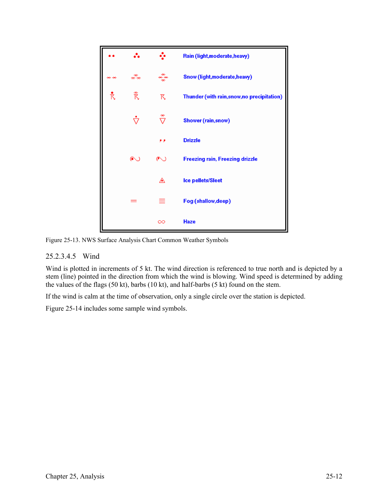

What is the main advantage of station plots on a surface analysis chart?

**Answer:** They allow a pilot to see many observed weather elements at many stations at once.

**Explanation:** Station plots compress wind, sky cover, visibility, pressure, weather, temperature, dew point, and pressure tendency into a compact symbol. This helps pilots recognize regional weather patterns rather than focusing on one airport only.

**Reference:** FAA Aviation Weather Handbook, Ch. 25, Aviation Interests Station Plot Model

**Asset Source:** `references/FAA Weather.pdf`, Figure 25-12, Surface Analysis Chart for Aviation Interests Station Plot Model, extracted to `Questions/assets/MET-181_surface_analysis_station_plot_aviation.png`

---

## MET-182
**Topic:** Meteorology - Weather Charts and Tools  
**Type:** Image Interpretation  
**Difficulty:** Basic  
**Tags:** wind-barbs, chart-symbols, winds

Using the asset, what does one long wind barb represent?

**Answer:** 10 knots.

**Explanation:** Wind barb feathers are additive: a short barb is 5 kt, a long barb is 10 kt, and a pennant is 50 kt.

**Reference:** FAA Aviation Weather Handbook, Ch. 25, Surface Analysis Chart Sample Wind Symbols

**Asset Source:** `references/FAA Weather.pdf`, Figure 25-14, NWS Surface Analysis Chart Sample Wind Symbols, extracted to `Questions/assets/MET-182_wind_barb_symbols.png`

---

## MET-183
**Topic:** Meteorology - Weather Charts and Tools  
**Type:** Image Interpretation  
**Difficulty:** Basic  
**Tags:** wind-barbs, speed, decoding

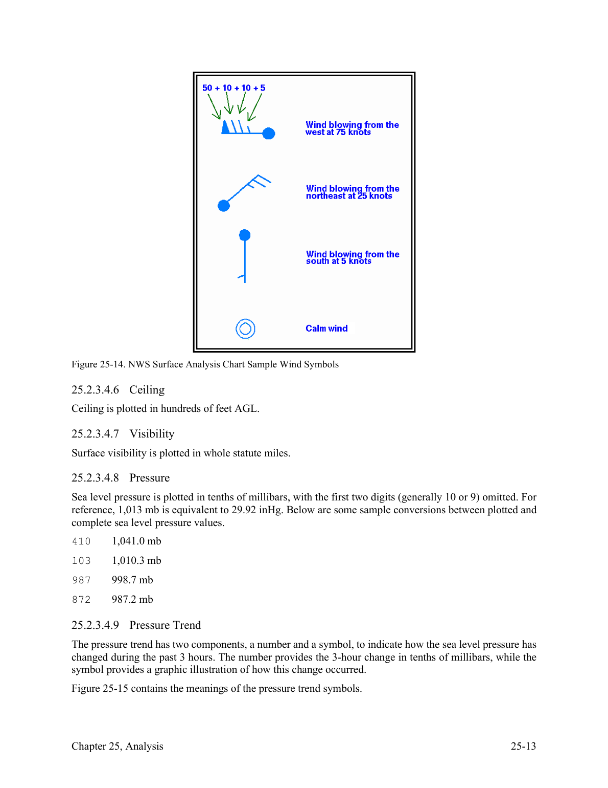

How would you decode a wind barb with one pennant, one long barb, and one short barb?

**Answer:** 65 knots.

**Explanation:** A pennant is 50 kt, a long barb is 10 kt, and a short barb is 5 kt. Added together, they indicate 65 kt.

**Reference:** FAA Aviation Weather Handbook, Ch. 25, Surface Analysis Chart Sample Wind Symbols

**Asset Source:** `references/FAA Weather.pdf`, Figure 25-14, NWS Surface Analysis Chart Sample Wind Symbols, extracted to `Questions/assets/MET-183_wind_barb_speed_practice.png`

---

## MET-184
**Topic:** Meteorology - Weather Charts and Tools  
**Type:** Image Interpretation  
**Difficulty:** Intermediate  
**Tags:** wind-barbs, direction, true-north

On weather charts, wind barbs point toward the station circle from the direction the wind is coming. If the shaft extends from the station circle toward the northwest, what is the wind direction?

**Answer:** Northwest wind.

**Explanation:** Wind direction in weather products is the direction from which the wind blows. A barb extending toward the northwest indicates wind coming from the northwest.

**Reference:** FAA Aviation Weather Handbook, Ch. 25, Station Plot Models; NAV CANADA Aviation Weather Services Guide, Weather Charts

**Asset Source:** `references/FAA Weather.pdf`, Figure 25-14, NWS Surface Analysis Chart Sample Wind Symbols, extracted to `Questions/assets/MET-184_wind_barb_direction_practice.png`

---

## MET-185
**Topic:** Meteorology - Weather Charts and Tools  
**Type:** Image Interpretation  
**Difficulty:** Basic  
**Tags:** wind-barbs, calm-wind, station-plot

On a station plot, how is calm wind commonly shown?

**Answer:** By a circle around the station with no wind shaft.

**Explanation:** Calm wind symbols differ from normal wind barbs because there is no meaningful direction to plot. Pilots should still check nearby stations and forecasts because calm surface wind does not rule out wind aloft or fog risk.

**Reference:** FAA Aviation Weather Handbook, Ch. 25, Surface Analysis Chart Sample Wind Symbols

**Asset Source:** `references/FAA Weather.pdf`, Figure 25-14, NWS Surface Analysis Chart Sample Wind Symbols, extracted to `Questions/assets/MET-185_wind_barb_calm_variable.png`

---

## MET-186
**Topic:** Meteorology - Weather Charts and Tools  
**Type:** Image Interpretation  
**Difficulty:** Intermediate  
**Tags:** pressure-tendency, station-plot, trends

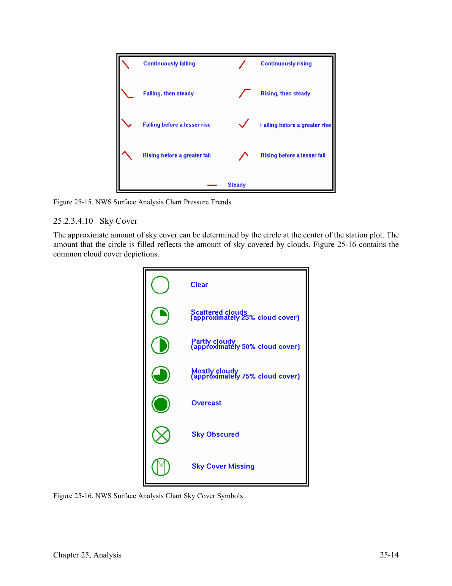

Why is pressure tendency useful to pilots when reading surface analysis or station plot information?

**Answer:** It helps identify whether pressure is rising, falling, or changing rapidly, which can indicate approaching or departing weather systems.

**Explanation:** Rapid pressure falls can suggest an approaching low or frontal system. Pressure trends should be considered with wind, cloud, visibility, radar, and forecast products.

**Reference:** FAA Aviation Weather Handbook, Ch. 25, Surface Analysis Chart Pressure Trends

**Asset Source:** `references/FAA Weather.pdf`, Figure 25-15, Surface Analysis Chart Pressure Trends, extracted to `Questions/assets/MET-186_pressure_trend_symbols.png`

---

## MET-187
**Topic:** Meteorology - Weather Charts and Tools  
**Type:** Image Interpretation  
**Difficulty:** Basic  
**Tags:** sky-cover, station-plot, symbols

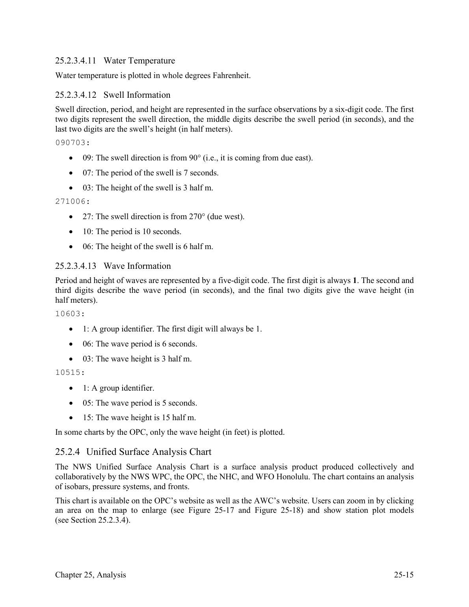

On a station plot, what does a completely filled station circle indicate?

**Answer:** Overcast sky cover.

**Explanation:** The amount of fill in the station circle indicates sky cover. A completely filled circle represents overcast conditions.

**Reference:** FAA Aviation Weather Handbook, Ch. 25, Surface Analysis Chart Sky Cover Symbols

**Asset Source:** `references/FAA Weather.pdf`, Figure 25-16, Surface Analysis Chart Sky Cover Symbols, extracted to `Questions/assets/MET-187_sky_cover_symbols.png`

---

## MET-188
**Topic:** Meteorology - Weather Charts and Tools  
**Type:** Multiple Choice  
**Difficulty:** Basic  
**Tags:** surface-analysis, valid-time, briefing

What should a pilot check before using any surface analysis chart for flight planning?

- A) The chart valid time
- B) The aircraft registration marks
- C) The fuel octane
- D) The seat position

**Answer:** A - The chart valid time

**Explanation:** Weather charts are time-sensitive. A surface analysis chart shows analyzed conditions at a specific valid time; it is not a route forecast by itself.

**Reference:** NAV CANADA Aviation Weather Services Guide, Weather Charts; FAA Aviation Weather Handbook, Ch. 25

---

## MET-189
**Topic:** Meteorology - Weather Charts and Tools  
**Type:** Open Answer  
**Difficulty:** Intermediate  
**Tags:** surface-analysis, preflight, interpretation

How can a surface analysis chart help a VFR pilot make a weather decision?

**Answer:** It helps the pilot see the broad weather pattern: highs, lows, fronts, troughs, ridges, isobars, wind patterns, and areas of significant weather. This gives context for METARs, TAFs, GFAs, radar, and satellite imagery.

**Explanation:** A single METAR only describes one point. A surface analysis chart helps explain why weather is changing and where deteriorating conditions may move next.

**Reference:** NAV CANADA Aviation Weather Services Guide, Weather Charts; FAA Aviation Weather Handbook, Ch. 25

---

## MET-190
**Topic:** Meteorology - Weather Charts and Tools  
**Type:** Image Interpretation  
**Difficulty:** Basic  
**Tags:** radar, composite-reflectivity, precipitation

What does composite reflectivity radar show?

**Answer:** The strongest radar return detected in a vertical column of the atmosphere.

**Explanation:** Composite reflectivity can reveal stronger precipitation aloft that may not appear as strongly on the lowest radar slice. It is useful for identifying convective intensity, but it can make precipitation appear more widespread or intense than what is occurring at low altitude.

**Reference:** FAA Aviation Weather Handbook, Ch. 24, Radar Observations

**Asset Source:** `references/FAA Weather.pdf`, Figure 24-12, Regional Radar Mosaic Example Using Composite Reflectivity, extracted to `Questions/assets/MET-190_radar_composite_reflectivity.png`

---

## MET-191
**Topic:** Meteorology - Weather Charts and Tools  
**Type:** Image Interpretation  
**Difficulty:** Basic  
**Tags:** radar, base-reflectivity, precipitation

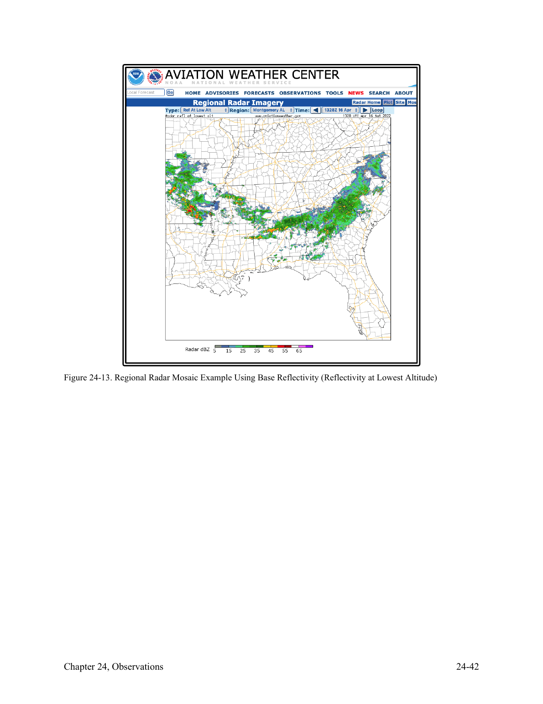

What does base reflectivity radar show?

**Answer:** Radar reflectivity from the lowest available radar elevation scan.

**Explanation:** Base reflectivity is useful for seeing precipitation closer to lower altitudes, but it may miss stronger precipitation aloft or weather hidden by terrain, range, or beam geometry.

**Reference:** FAA Aviation Weather Handbook, Ch. 24, Radar Observations

**Asset Source:** `references/FAA Weather.pdf`, Figure 24-13, Regional Radar Mosaic Example Using Base Reflectivity, extracted to `Questions/assets/MET-191_radar_base_reflectivity.png`

---

## MET-192
**Topic:** Meteorology - Weather Charts and Tools  
**Type:** Image Interpretation  
**Difficulty:** Intermediate  
**Tags:** radar, echo-tops, thunderstorm

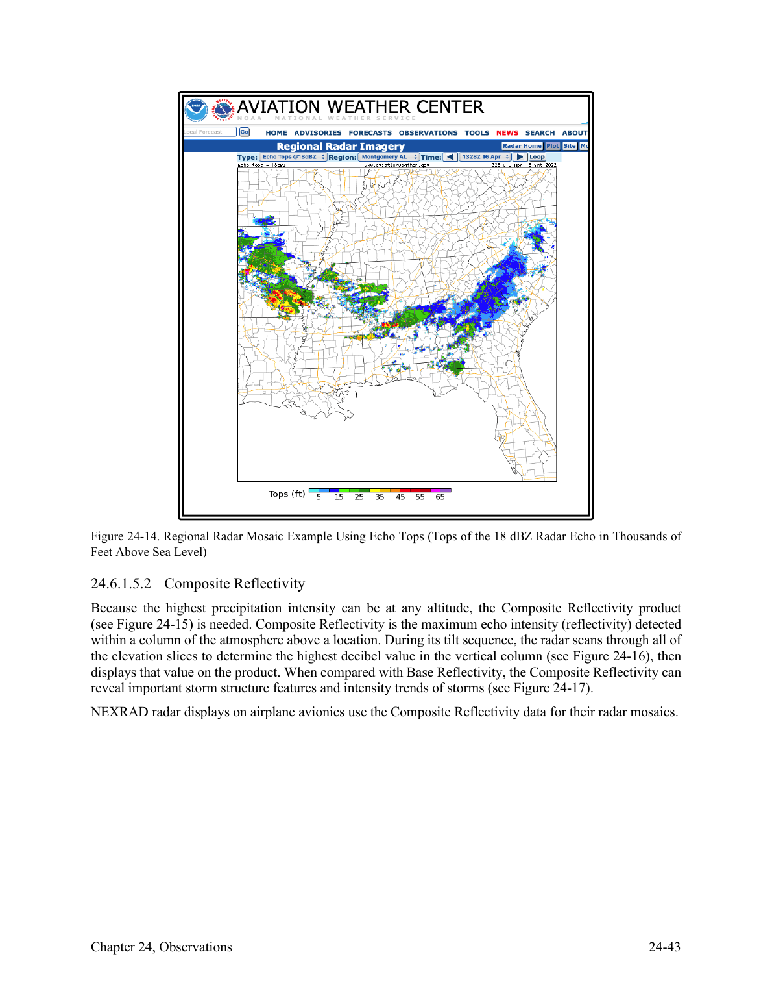

What does an echo tops radar product indicate?

**Answer:** The altitude of the top of radar-detectable precipitation echoes, often using a threshold such as 18 dBZ.

**Explanation:** Echo tops are not the same as cloud tops. Cloud tops can be higher than the top of the precipitation echo, especially in thunderstorms.

**Reference:** FAA Aviation Weather Handbook, Ch. 24, Radar Observations

**Asset Source:** `references/FAA Weather.pdf`, Figure 24-14, Regional Radar Mosaic Example Using Echo Tops, extracted to `Questions/assets/MET-192_radar_echo_tops.png`

---

## MET-193
**Topic:** Meteorology - Weather Charts and Tools  
**Type:** Image Interpretation  
**Difficulty:** Intermediate  
**Tags:** radar, composite-vs-base, interpretation

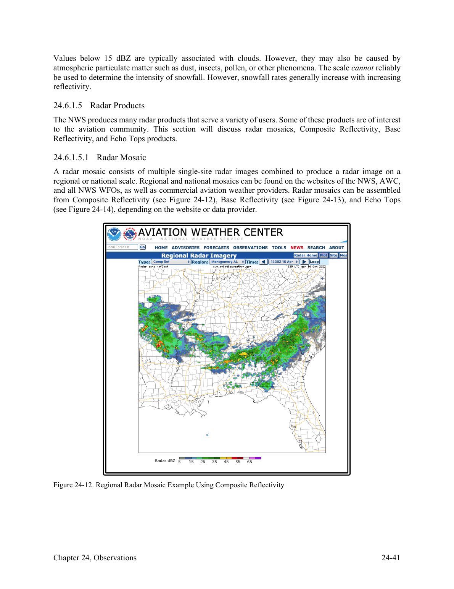

Why should a pilot understand the difference between composite reflectivity and base reflectivity?

**Answer:** Because composite reflectivity shows the strongest return anywhere in the vertical column, while base reflectivity shows the lowest scan; each can emphasize different hazards.

**Explanation:** Composite reflectivity may highlight elevated convective cores, while base reflectivity may better represent precipitation closer to the surface. Pilots should avoid using a single radar product as the whole weather picture.

**Reference:** FAA Aviation Weather Handbook, Ch. 24, Radar Observations

**Asset Source:** `references/FAA Weather.pdf`, Figure 24-12, Regional Radar Mosaic Example Using Composite Reflectivity, extracted to `Questions/assets/MET-193_composite_vs_base_reflectivity.png`

---

## MET-194
**Topic:** Meteorology - Weather Charts and Tools  
**Type:** Image Interpretation  
**Difficulty:** Intermediate  
**Tags:** radar, base-reflectivity, limitations

Why might base reflectivity fail to show the full strength of a thunderstorm?

**Answer:** It uses the lowest available radar elevation scan, so stronger precipitation or hail cores aloft may not be fully represented.

**Explanation:** Thunderstorms are three-dimensional. Pilots should use radar together with echo tops, satellite imagery, lightning information, forecasts, PIREPs, and visual avoidance.

**Reference:** FAA Aviation Weather Handbook, Ch. 24, Radar Observations

**Asset Source:** `references/FAA Weather.pdf`, Figure 24-13, Regional Radar Mosaic Example Using Base Reflectivity, extracted to `Questions/assets/MET-194_base_reflectivity_lowest_slice.png`

---

## MET-195
**Topic:** Meteorology - Weather Charts and Tools  
**Type:** Image Interpretation  
**Difficulty:** Intermediate  
**Tags:** radar, convective-precipitation, thunderstorm

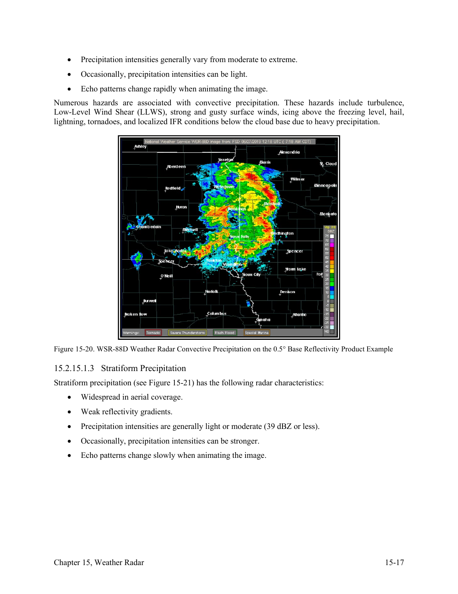

What radar pattern is commonly associated with convective precipitation?

**Answer:** Cellular or sharply defined areas of stronger reflectivity, often with rapid changes in intensity.

**Explanation:** Convective precipitation is associated with vertical development, strong updrafts and downdrafts, turbulence, hail, lightning, and heavy showers. VFR pilots should give convective cells wide clearance.

**Reference:** FAA Aviation Weather Handbook, Ch. 15, Weather Radar, Convective Precipitation

**Asset Source:** `references/FAA Weather.pdf`, Figure 15-20, WSR-88D Convective Precipitation Example, extracted to `Questions/assets/MET-195_convective_radar_example.png`

---

## MET-196
**Topic:** Meteorology - Weather Charts and Tools  
**Type:** Image Interpretation  
**Difficulty:** Intermediate  
**Tags:** radar, stratiform-precipitation, widespread-weather

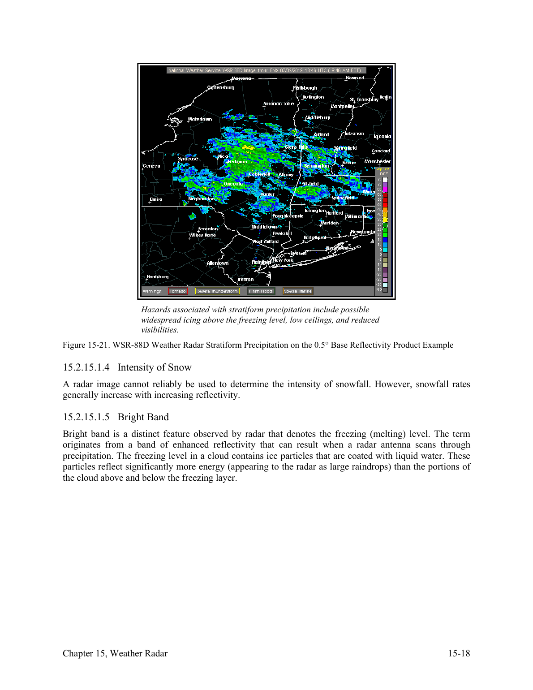

What radar pattern is commonly associated with stratiform precipitation?

**Answer:** Broad, more uniform areas of precipitation.

**Explanation:** Stratiform precipitation is often associated with layered cloud, widespread lower ceilings, reduced visibility, and steady rain or snow. It may look less intense than thunderstorms but can still make a route unsuitable for VFR.

**Reference:** FAA Aviation Weather Handbook, Ch. 15, Weather Radar, Stratiform Precipitation

**Asset Source:** `references/FAA Weather.pdf`, Figure 15-21, WSR-88D Stratiform Precipitation Example, extracted to `Questions/assets/MET-196_stratiform_radar_example.png`

---

## MET-197
**Topic:** Meteorology - Weather Charts and Tools  
**Type:** Image Interpretation  
**Difficulty:** Advanced  
**Tags:** radar, anomalous-propagation, false-returns

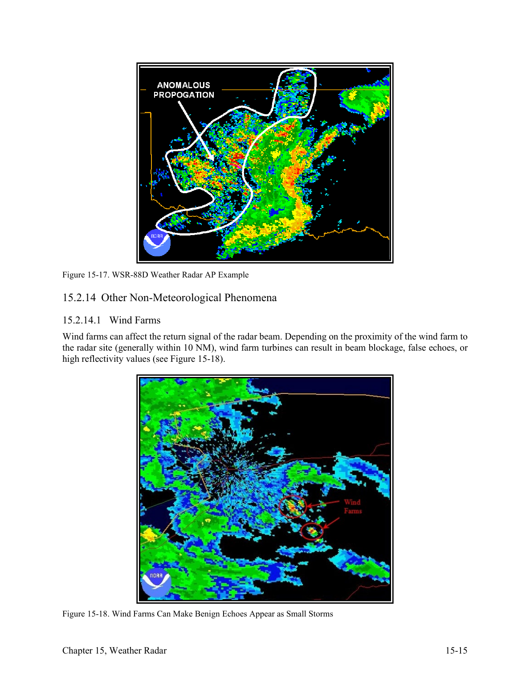

What is anomalous propagation on weather radar?

**Answer:** False or misleading radar echoes caused by unusual bending of the radar beam, often due to atmospheric refraction.

**Explanation:** Anomalous propagation can make ground targets appear as precipitation. Pilots should compare radar with satellite, METARs, PIREPs, and the larger weather situation before assuming every return is real precipitation.

**Reference:** FAA Aviation Weather Handbook, Ch. 15, Weather Radar, Anomalous Propagation

**Asset Source:** `references/FAA Weather.pdf`, Figure 15-17, WSR-88D Weather Radar AP Example, extracted to `Questions/assets/MET-197_anomalous_propagation_radar.png`

---

## MET-198
**Topic:** Meteorology - Weather Charts and Tools  
**Type:** Image Interpretation  
**Difficulty:** Advanced  
**Tags:** radar, attenuation, thunderstorm

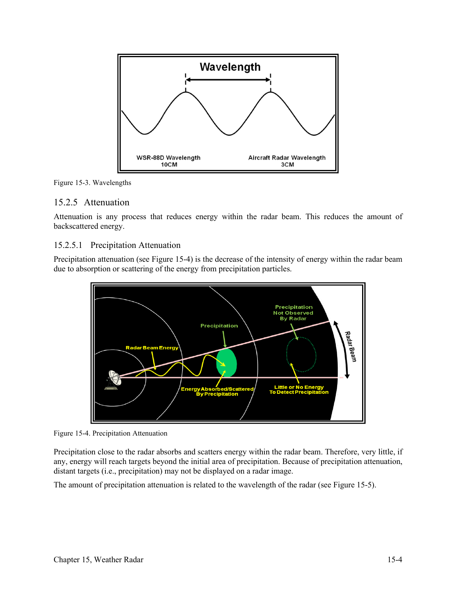

Why is radar attenuation dangerous when interpreting intense precipitation?

**Answer:** Heavy precipitation can weaken or block the radar beam, hiding more severe weather behind the first strong return.

**Explanation:** An area behind a very strong cell may appear weaker or clear because the radar energy has been absorbed or scattered. This is one reason pilots should not attempt to pick through thunderstorms using radar alone.

**Reference:** FAA Aviation Weather Handbook, Ch. 15, Weather Radar, Precipitation Attenuation

**Asset Source:** `references/FAA Weather.pdf`, Figure 15-4, Precipitation Attenuation, extracted to `Questions/assets/MET-198_radar_attenuation.png`

---

## MET-199
**Topic:** Meteorology - Weather Charts and Tools  
**Type:** Image Interpretation  
**Difficulty:** Advanced  
**Tags:** radar, beam-blockage, terrain

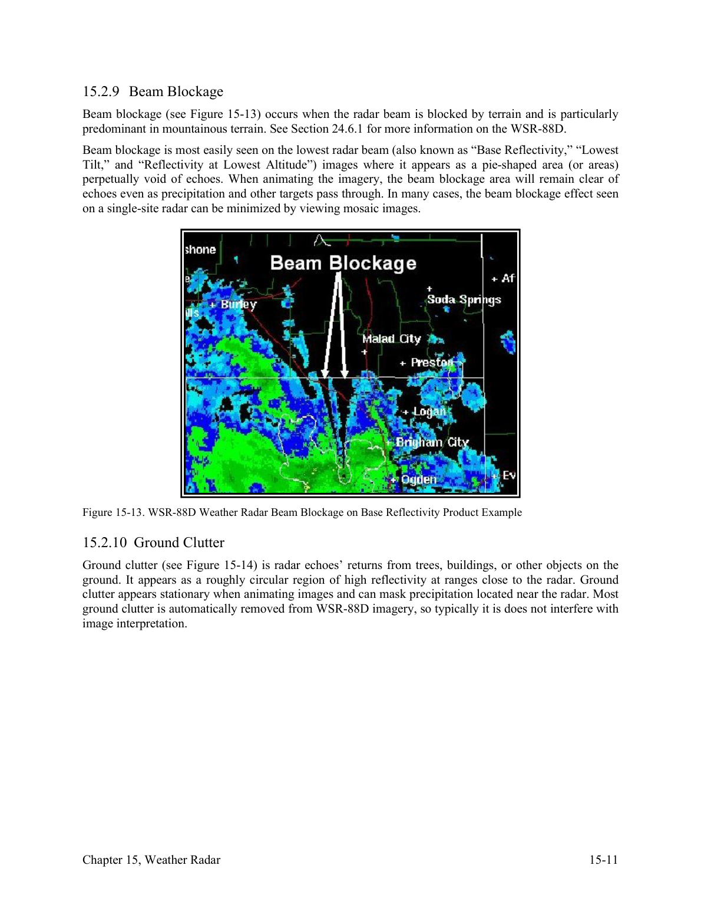

What is radar beam blockage?

**Answer:** Terrain or obstacles block part of the radar beam, reducing or eliminating radar coverage behind the blockage.

**Explanation:** Radar coverage can be poor in mountainous areas or at low altitudes. A lack of radar returns does not always mean there is no weather.

**Reference:** FAA Aviation Weather Handbook, Ch. 15, Weather Radar, Beam Blockage

**Asset Source:** `references/FAA Weather.pdf`, Figure 15-13, WSR-88D Weather Radar Beam Blockage Example, extracted to `Questions/assets/MET-199_radar_beam_blockage.png`

---

## MET-200
**Topic:** Meteorology - Weather Charts and Tools  
**Type:** Image Interpretation  
**Difficulty:** Basic  
**Tags:** satellite, geocolor, cloud-patterns

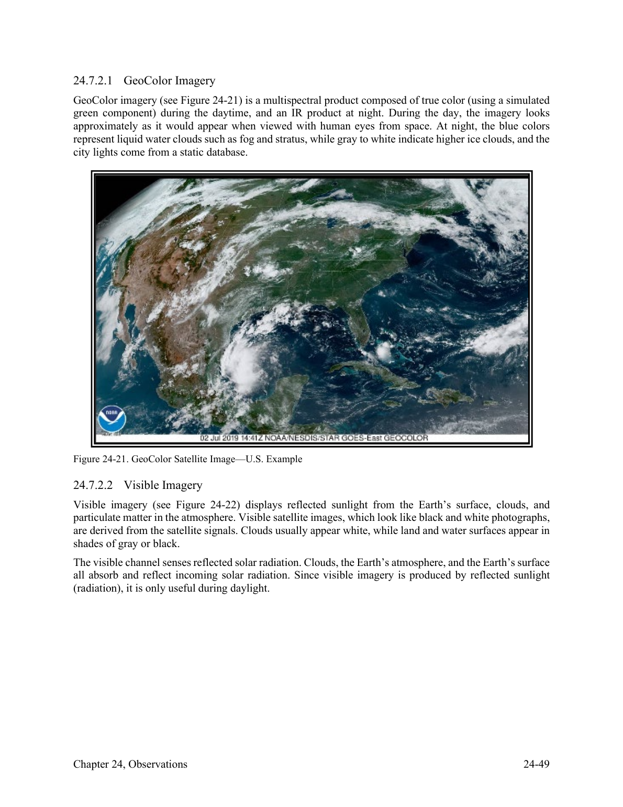

What is a GeoColor satellite image useful for?

**Answer:** It gives an easy visual overview of cloud patterns and larger-scale weather features.

**Explanation:** GeoColor imagery combines multiple satellite channels into a visually intuitive product. It is useful for situational awareness, but pilots should still compare it with METARs, TAFs, GFAs, radar, and PIREPs.

**Reference:** FAA Aviation Weather Handbook, Ch. 24, Satellite Observations

**Asset Source:** `references/FAA Weather.pdf`, Figure 24-21, GeoColor Satellite Image Example, extracted to `Questions/assets/MET-200_geocolor_satellite.png`

---

## MET-201
**Topic:** Meteorology - Weather Charts and Tools  
**Type:** Image Interpretation  
**Difficulty:** Basic  
**Tags:** satellite, visible, daylight

What does visible satellite imagery show?

**Answer:** Reflected sunlight from clouds and the Earth's surface.

**Explanation:** Visible imagery can show cloud texture and low cloud detail well during daylight, but it is not useful in darkness because it depends on sunlight.

**Reference:** FAA Aviation Weather Handbook, Ch. 24, Visible Satellite Imagery

**Asset Source:** `references/FAA Weather.pdf`, Figure 24-22, Visible Satellite Image Example, extracted to `Questions/assets/MET-201_visible_satellite.png`

---

## MET-202
**Topic:** Meteorology - Weather Charts and Tools  
**Type:** Image Interpretation  
**Difficulty:** Basic  
**Tags:** satellite, infrared, cloud-tops

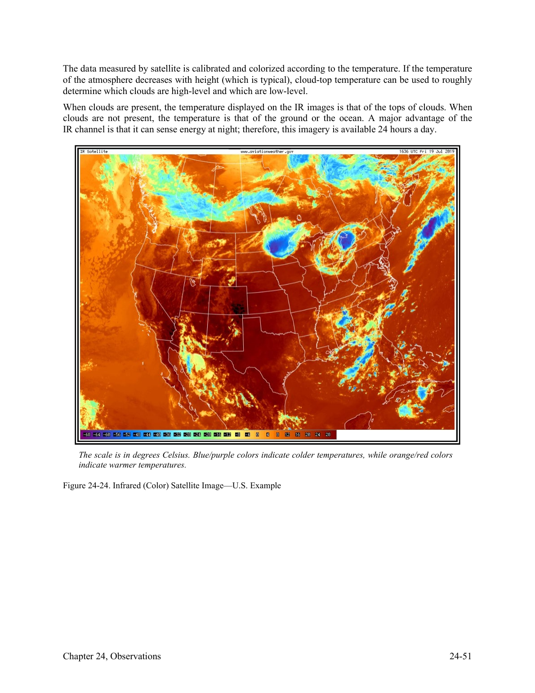

What does infrared satellite imagery primarily display?

**Answer:** Temperature patterns of the Earth, cloud tops, and atmosphere.

**Explanation:** Colder cloud tops usually indicate higher clouds. Infrared imagery can be useful at night, unlike visible imagery.

**Reference:** FAA Aviation Weather Handbook, Ch. 24, Infrared Satellite Imagery

**Asset Source:** `references/FAA Weather.pdf`, Figure 24-24, Infrared Satellite Image Example, extracted to `Questions/assets/MET-202_infrared_satellite.png`

---

## MET-203
**Topic:** Meteorology - Weather Charts and Tools  
**Type:** Image Interpretation  
**Difficulty:** Intermediate  
**Tags:** satellite, visible, limitation

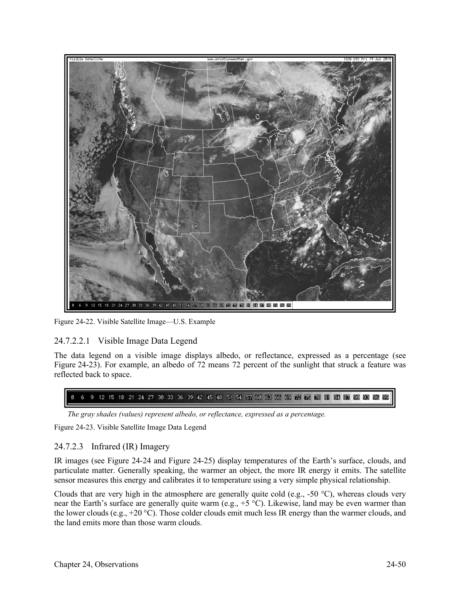

What is the major limitation of visible satellite imagery for a night VFR flight?

**Answer:** It depends on reflected sunlight, so it is not useful after dark.

**Explanation:** At night, pilots should rely more on infrared satellite imagery, METARs, TAFs, GFAs, radar, PIREPs, and briefings.

**Reference:** FAA Aviation Weather Handbook, Ch. 24, Visible Satellite Imagery

**Asset Source:** `references/FAA Weather.pdf`, Figure 24-22, Visible Satellite Image Example, extracted to `Questions/assets/MET-203_visible_satellite_daylight_limit.png`

---

## MET-204
**Topic:** Meteorology - Weather Charts and Tools  
**Type:** Image Interpretation  
**Difficulty:** Intermediate  
**Tags:** satellite, infrared, thunderstorms

On infrared satellite imagery, what does a very cold cloud-top signature often suggest?

**Answer:** High cloud tops, which may indicate deep convection or high-level cloud.

**Explanation:** Infrared imagery senses temperature. Since temperature generally decreases with altitude in the troposphere, very cold cloud tops are often high. Pilots should compare this with radar and forecasts to identify thunderstorm risk.

**Reference:** FAA Aviation Weather Handbook, Ch. 24, Infrared Satellite Imagery

**Asset Source:** `references/FAA Weather.pdf`, Figure 24-24, Infrared Satellite Image Example, extracted to `Questions/assets/MET-204_infrared_cloud_tops.png`

---

## MET-205
**Topic:** Meteorology - Weather Charts and Tools  
**Type:** Multiple Choice  
**Difficulty:** Intermediate  
**Tags:** satellite, water-vapor, upper-air

What is water vapour satellite imagery mainly used to assess?

- A) Moisture patterns in the middle and upper atmosphere
- B) Runway braking action
- C) Exact surface visibility at an airport
- D) Fuel temperature

**Answer:** A - Moisture patterns in the middle and upper atmosphere

**Explanation:** Water vapour imagery helps identify larger-scale moisture, dry slots, and upper-level features. It does not directly show low cloud or surface visibility.

**Reference:** FAA Aviation Weather Handbook, Ch. 24, Water Vapor Satellite Imagery

---

## MET-206
**Topic:** Meteorology - Weather Charts and Tools  
**Type:** Open Answer  
**Difficulty:** Intermediate  
**Tags:** satellite, radar, comparison

Why should pilots compare satellite imagery with radar rather than using either product alone?

**Answer:** Satellite imagery shows cloud patterns and cloud-top information, while radar shows precipitation echoes. A cloud layer may not appear on radar if it has little or no precipitation, and radar may not show cloud tops.

**Explanation:** Combining products gives a more complete picture. Satellite can reveal cloud shields and convective growth, while radar helps locate precipitation intensity and movement.

**Reference:** FAA Aviation Weather Handbook, Ch. 24, Radar and Satellite Observations; NAV CANADA Aviation Weather Services Guide, Radar and Satellite Imagery

---

## MET-207
**Topic:** Meteorology - Weather Charts and Tools  
**Type:** Scenario Based  
**Difficulty:** Intermediate  
**Tags:** satellite, low-cloud, vfr

A visible satellite image shows a widespread smooth grey cloud layer over your route, but radar shows little precipitation. What hazard may still exist for a VFR pilot?

**Answer:** Widespread cloud cover, low ceilings, or poor VFR conditions may still exist even without radar precipitation.

**Explanation:** Radar is primarily a precipitation tool. Non-precipitating low stratus can create a serious VFR ceiling problem while producing little or no radar return.

**Reference:** FAA Aviation Weather Handbook, Ch. 24, Radar and Satellite Observations; NAV CANADA Aviation Weather Services Guide, Satellite Imagery

---

## MET-208
**Topic:** Meteorology - Weather Charts and Tools  
**Type:** Multiple Choice  
**Difficulty:** Basic  
**Tags:** winds-aloft, fb, forecast

What is an upper wind and temperature forecast used for?

- A) Estimating winds and temperatures aloft for navigation, groundspeed, fuel planning, and performance
- B) Measuring runway friction
- C) Reporting actual cloud base at one airport
- D) Replacing the altimeter setting

**Answer:** A - Estimating winds and temperatures aloft for navigation, groundspeed, fuel planning, and performance

**Explanation:** Winds aloft affect heading, groundspeed, fuel burn, endurance, diversion planning, and turbulence expectations.

**Reference:** NAV CANADA Aviation Weather Services Guide, Upper Level Wind and Temperature Forecast (FB); FAA Aviation Weather Handbook, Ch. 27

---

## MET-209
**Topic:** Meteorology - Weather Charts and Tools  
**Type:** Scenario Based  
**Difficulty:** Basic  
**Tags:** winds-aloft, fb, decoding

In an upper wind forecast, decode `2708+05`.

**Answer:** Wind from 270 degrees true at 8 knots, temperature +5 degrees C.

**Explanation:** In the common FB wind-temperature format, the first two digits represent direction in tens of degrees, the next two represent speed in knots, and the final signed value is temperature.

**Reference:** NAV CANADA Aviation Weather Services Guide, Upper Level Wind and Temperature Forecast (FB); FAA Aviation Weather Handbook, Ch. 27

---

## MET-210
**Topic:** Meteorology - Weather Charts and Tools  
**Type:** Image Interpretation  
**Difficulty:** Intermediate  
**Tags:** winds-aloft, fb, decoding-table

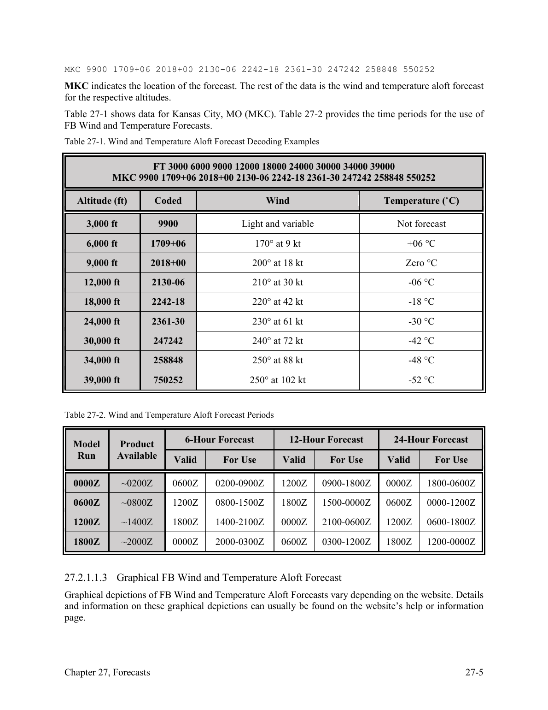

Using the coding examples shown in the asset, what does `9900` mean in a winds aloft forecast?

**Answer:** Light and variable wind, less than 5 knots.

**Explanation:** `9900` is a special code used when wind is light and variable.

**Reference:** FAA Aviation Weather Handbook, Ch. 27, Table 27-1; NAV CANADA Aviation Weather Services Guide, Upper Level Wind and Temperature Forecast (FB)

**Asset Source:** `references/FAA Weather.pdf`, Table 27-1, Wind and Temperature Aloft Forecast Decoding Examples, extracted to `Questions/assets/MET-210_fb_winds_aloft_decoding_table.png`

---

## MET-211
**Topic:** Meteorology - Weather Charts and Tools  
**Type:** Scenario Based  
**Difficulty:** Advanced  
**Tags:** winds-aloft, fb, strong-wind

In an upper wind forecast, decode `731960`.

**Answer:** Wind from 230 degrees true at 119 knots, temperature -60 degrees C.

**Explanation:** For wind speeds of 100 kt or more, subtract 50 from the coded direction and add 100 to the coded speed. `73` becomes `23`, or 230 degrees, and `19` becomes 119 kt. At high levels, temperatures are assumed negative unless otherwise indicated.

**Reference:** FAA Aviation Weather Handbook, Ch. 27, Table 27-1; NAV CANADA Aviation Weather Services Guide, Upper Level Wind and Temperature Forecast (FB)

---

## MET-212
**Topic:** Meteorology - Weather Charts and Tools  
**Type:** Multiple Choice  
**Difficulty:** Intermediate  
**Tags:** winds-aloft, true-direction, navigation

In aviation weather products, winds aloft directions are normally referenced to:

- A) True north
- B) Magnetic north only
- C) Runway heading only
- D) Compass north after deviation correction

**Answer:** A - True north

**Explanation:** Weather wind directions are normally true. Pilots must account for magnetic variation when converting forecast winds into cockpit heading calculations.

**Reference:** NAV CANADA Aviation Weather Services Guide, Upper Level Wind and Temperature Forecast (FB); FAA Aviation Weather Handbook, Ch. 27

---

## MET-213
**Topic:** Meteorology - Weather Charts and Tools  
**Type:** Image Interpretation  
**Difficulty:** Intermediate  
**Tags:** winds-aloft, graphical-display, route-planning

What is the advantage of a graphical winds aloft display compared with a text table?

**Answer:** It helps the pilot quickly visualize wind patterns over a broad area and compare possible routes or altitudes.

**Explanation:** A text FB can be precise for selected stations, while a graphical display gives spatial context. Both should be checked for valid time and altitude.

**Reference:** FAA Aviation Weather Handbook, Ch. 27, Graphical FB Wind and Temperature Aloft Forecast

**Asset Source:** `references/FAA Weather.pdf`, Figure 27-1, FB Wind and Temperature Aloft Interactive Display Example, extracted to `Questions/assets/MET-213_fb_winds_aloft_graphical_display.png`

---

## MET-214
**Topic:** Meteorology - Weather Charts and Tools  
**Type:** Image Interpretation  
**Difficulty:** Intermediate  
**Tags:** winds-aloft, altitude-selection, fuel-planning

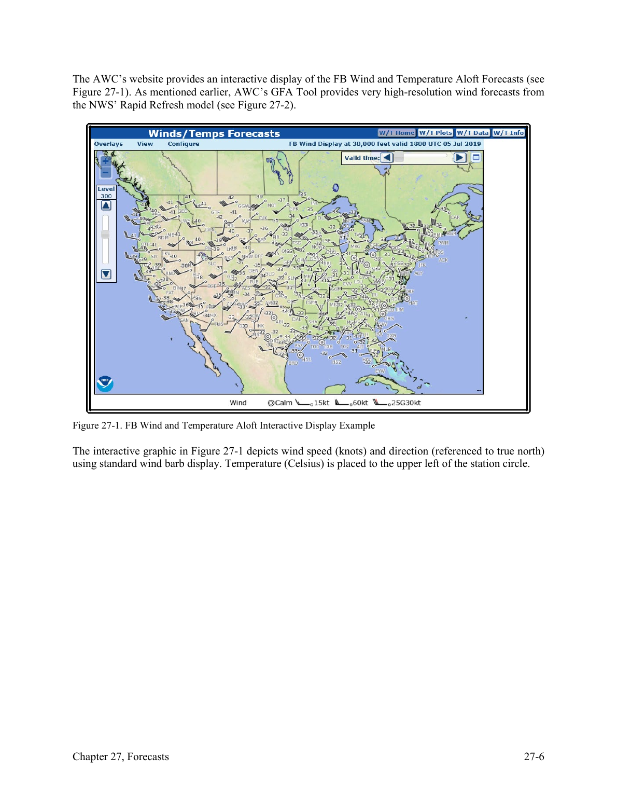

How can winds aloft information affect altitude selection on a VFR cross-country?

**Answer:** A pilot may choose an altitude with a weaker headwind, stronger tailwind, less turbulence, better temperature, or better terrain/cloud clearance.

**Explanation:** Winds aloft can change significantly with altitude. A small altitude change can improve groundspeed, fuel planning, and comfort.

**Reference:** FAA Aviation Weather Handbook, Ch. 27, Graphical FB Wind and Temperature Aloft Forecast; Transport Canada Flight Training Manual, Pilot Navigation - Weather

**Asset Source:** `references/FAA Weather.pdf`, Figure 27-1, FB Wind and Temperature Aloft Interactive Display Example, extracted to `Questions/assets/MET-214_graphical_winds_aloft_display.png`

---

## MET-215
**Topic:** Meteorology - Weather Charts and Tools  
**Type:** Open Answer  
**Difficulty:** Intermediate  
**Tags:** winds-aloft, flight-planning, groundspeed

Why can a strong headwind aloft change a go/no-go decision even if ceiling and visibility are good?

**Answer:** A strong headwind can reduce groundspeed, increase time enroute, increase fuel burn, reduce reserve margin, and make alternates harder to reach.

**Explanation:** Weather decision-making includes performance and fuel margins, not only cloud and visibility. Winds aloft are therefore a safety factor for VFR pilots.

**Reference:** Transport Canada Flight Training Manual, Pilot Navigation - Weather and Choosing an Altitude; NAV CANADA Aviation Weather Services Guide, FB Forecast

---

## MET-216
**Topic:** Meteorology - Weather Charts and Tools  
**Type:** Scenario Based  
**Difficulty:** Intermediate  
**Tags:** winds-aloft, turbulence, shear

Surface wind is light, but the winds aloft forecast shows 45 kt at 3,000 ft. What should a pilot consider?

**Answer:** Possible wind shear, mechanical turbulence near terrain, large groundspeed changes, and drift correction.

**Explanation:** Light surface wind does not guarantee smooth or weak wind aloft. A strong change in wind speed over a short height can be operationally significant.

**Reference:** NAV CANADA Aviation Weather Services Guide, Upper Level Wind and Temperature Forecast; FAA Aviation Weather Handbook, Wind and Turbulence

---

## MET-217
**Topic:** Meteorology - Weather Charts and Tools  
**Type:** Multiple Choice  
**Difficulty:** Basic  
**Tags:** weather-tools, radar, satellite

Which product is best for identifying precipitation intensity and movement?

- A) Weather radar
- B) Visible satellite only
- C) Winds aloft table only
- D) Surface pressure chart only

**Answer:** A - Weather radar

**Explanation:** Radar detects precipitation-sized targets and displays echo intensity. It is not a complete cloud or icing product.

**Reference:** NAV CANADA Aviation Weather Services Guide, Radar Imagery; FAA Aviation Weather Handbook, Ch. 24

---

## MET-218
**Topic:** Meteorology - Weather Charts and Tools  
**Type:** Multiple Choice  
**Difficulty:** Intermediate  
**Tags:** weather-tools, satellite, cloud-cover

Which product is usually better for seeing broad cloud shields that may not be producing precipitation?

- A) Satellite imagery
- B) Runway visual range
- C) Altimeter setting only
- D) Magnetic compass

**Answer:** A - Satellite imagery

**Explanation:** Satellite imagery shows cloud patterns, while radar primarily shows precipitation. Broad non-precipitating stratus may be visible on satellite but not radar.

**Reference:** NAV CANADA Aviation Weather Services Guide, Satellite Imagery; FAA Aviation Weather Handbook, Ch. 24

---

## MET-219
**Topic:** Meteorology - Weather Charts and Tools  
**Type:** Scenario Based  
**Difficulty:** Advanced  
**Tags:** integrated-interpretation, radar, satellite, surface-analysis

Radar shows a narrow line of strong echoes approaching your route, satellite shows rapidly growing cloud tops, and the surface analysis shows a cold front nearby. What should a VFR pilot suspect?

**Answer:** Convective frontal weather, possibly thunderstorms or a squall line.

**Explanation:** Strong linear radar returns, growing cold cloud tops, and a cold front are consistent with hazardous convective development. A VFR pilot should delay, reroute, or obtain a detailed briefing rather than attempting to cross the line.

**Reference:** FAA Aviation Weather Handbook, Ch. 24 and Ch. 25; NAV CANADA Aviation Weather Services Guide, Radar, Satellite, and Weather Charts

---

## MET-220
**Topic:** Meteorology - Weather Charts and Tools  
**Type:** Multiple Choice  
**Difficulty:** Intermediate  
**Tags:** weather-tools, limitations, preflight

Which statement about weather tools is safest?

- A) No single chart or image is enough by itself
- B) Radar proves all clouds are safe if no echoes appear
- C) Satellite replaces METARs and TAFs
- D) Winds aloft are only useful for IFR flights

**Answer:** A - No single chart or image is enough by itself

**Explanation:** Good weather decisions compare current observations, forecasts, charts, radar, satellite, PIREPs, and briefings. Each product has limitations.

**Reference:** NAV CANADA Aviation Weather Services Guide, Weather Briefing Tips; Transport Canada Flight Training Manual, Pilot Navigation - Weather

---

## MET-221
**Topic:** Meteorology - Weather Charts and Tools  
**Type:** Scenario Based  
**Difficulty:** Intermediate  
**Tags:** product-validity, radar, satellite, briefing

You find a radar image that looks acceptable, but it is 90 minutes old. How should you treat it?

**Answer:** As stale information that should not be used alone for a current go/no-go decision.

**Explanation:** Radar and satellite products are time-sensitive. Convective weather can develop and move quickly. Always check the product time stamp and obtain current information.

**Reference:** NAV CANADA Aviation Weather Services Guide, Weather Briefing Tips and Radar Imagery

---

## MET-222
**Topic:** Meteorology - Weather Charts and Tools  
**Type:** Multiple Choice  
**Difficulty:** Basic  
**Tags:** weather-charts, fronts, pressure

Which chart is best for identifying the position of highs, lows, fronts, troughs, ridges, and isobars?

- A) Surface analysis chart
- B) Carburettor icing chart only
- C) Aircraft weight and balance graph
- D) Airport diagram

**Answer:** A - Surface analysis chart

**Explanation:** Surface analysis charts show the broad pressure pattern and frontal structure. They help explain current and expected weather trends.

**Reference:** NAV CANADA Aviation Weather Services Guide, Weather Charts; FAA Aviation Weather Handbook, Ch. 25

---

## MET-223
**Topic:** Meteorology - Weather Charts and Tools  
**Type:** Scenario Based  
**Difficulty:** Advanced  
**Tags:** integrated-interpretation, vfr, weather-decision

Your route has no radar echoes, but satellite imagery shows a widespread low cloud deck, METARs along the route report BKN006, and the surface analysis shows moist onshore flow. What is the main VFR hazard?

**Answer:** Low ceilings along the route despite little or no precipitation.

**Explanation:** Radar can look quiet when low stratus is the main hazard. Satellite, METARs, and surface flow give the better clues for ceiling problems.

**Reference:** NAV CANADA Aviation Weather Services Guide, Satellite Imagery, METAR, and Weather Charts; Transport Canada Flight Training Manual, Pilot Navigation - Weather

---

## MET-224
**Topic:** Meteorology - Weather Charts and Tools  
**Type:** Open Answer  
**Difficulty:** Intermediate  
**Tags:** weather-briefing, tools, cross-country

For a VFR cross-country, list five weather chart or tool items you should check before departure.

**Answer:** Examples include surface analysis chart, GFA or area forecast, METARs/SPECIs, TAFs, radar imagery, satellite imagery, winds aloft, PIREPs, AIRMETs/SIGMETs, and NOTAM/weather briefing information.

**Explanation:** Cross-country weather decisions require both current conditions and forecast trends across the whole route, not just the departure airport.

**Reference:** NAV CANADA Aviation Weather Services Guide, Weather Briefing Tips; Transport Canada Flight Training Manual, Pilot Navigation - Weather

---

## MET-225
**Topic:** Meteorology - Weather Charts and Tools  
**Type:** Scenario Based  
**Difficulty:** Advanced  
**Tags:** integrated-interpretation, go-no-go, route-planning

You plan a VFR flight. The surface analysis shows a deep low with tight isobars crossing your route, radar shows widespread precipitation, satellite shows an extensive cloud shield, and winds aloft forecast a strong headwind. What is the safest conclusion?

**Answer:** The weather picture is unfavorable for a simple VFR flight; delay, reroute, or obtain a detailed FIC briefing before considering departure.

**Explanation:** Tight isobars suggest strong winds and turbulence, radar shows precipitation, satellite shows widespread cloud, and winds aloft reduce performance and fuel margins. The combined picture matters more than any single product.

**Reference:** NAV CANADA Aviation Weather Services Guide, Weather Briefing Tips, Radar, Satellite, Weather Charts, and FB Forecast; Transport Canada Flight Training Manual, Pilot Navigation - Weather

---
