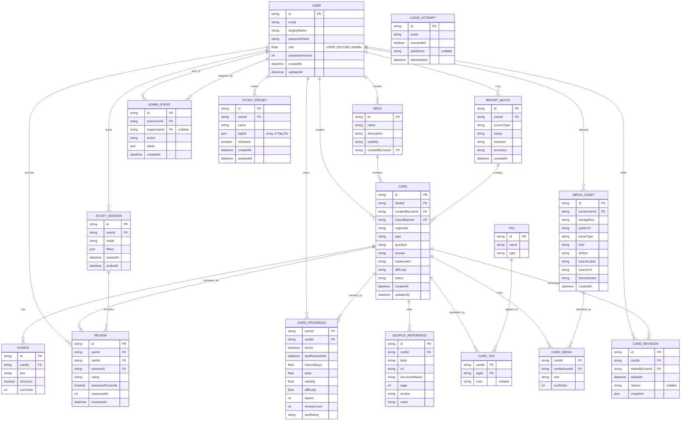

# Core Domain Model

This diagram reflects the current Prisma schema (`app/prisma/schema.prisma`). It should be updated whenever the schema changes.

## Relationship Notes

- `CardProgress` is per user and per card. This lets multiple users study the same deck while keeping separate spaced repetition state.
- `Review` is append-only history. The scheduler can be changed later because the raw review events are preserved.
- `Choice` exists only for multiple-choice cards. Open-answer cards do not need choices.
- `Tag` is flexible. Topic, source, skill area, and custom filters all use the same tagging system.
- `MediaAsset` stores file metadata; the actual file lives in object storage or a local volume. `sourceLabel` holds the attribution credit line (author and license), `sourceUrl` holds the origin URL where the asset was obtained, and `licenseNotes` holds additional license detail when needed.
- `SourceReference` is separate from tags so a card can have precise references as well as broad filterable labels.
- `ImportBatch` records how cards entered the system and supports preview, validation, rollback, and later export/debug workflows.
- `Card.originalId` preserves the source identifier from the import file (e.g. `"MET-042"`) for traceability and idempotent re-imports.
- `Card.importBatchId` links a card back to the import run that created it.
- `CardTag.note` stores a free-text annotation when the tag is the special `flagged` marker — lets the user record what they think is wrong with a card for later review.
- `CardRevision` is append-only edit history. One row is written before every card save, capturing the full card state as a JSON snapshot (question, answer, explanation, difficulty, status, choices, tags, flagNote). The UI for browsing and restoring revisions is deferred to a later phase; the table exists now so no edit history is lost.
- `User.role` is a three-level enum: `USER` (study + flag + change own password), `EDITOR` (+ card create/edit/import), `ADMIN` (+ manage users). Role checks use a numeric rank comparison so `EDITOR` implicitly satisfies any `USER` check.
- `User.passwordVersion` is incremented on every password change or role change. The value is embedded in the session cookie; `requireRole()` re-reads it from the DB to detect stale sessions without a server-side session store.
- `LoginAttempt` is email-keyed (no `userId` FK) so lock-out behaviour is identical whether the account exists or not, preventing user enumeration via timing differences. Ten failures in 15 minutes locks the account; rows older than 24 h are pruned on each write.
- `AdminEvent` is an append-only audit log written by every admin action (`CREATE_USER`, `CHANGE_ROLE`, `RESET_PASSWORD`, `DELETE_USER`). It records the actor, optional target user, and a JSON detail blob.
- `StudyPreset` stores a named tag selection the user can reload on the study setup page. `tagIds` is a JSON array of Tag IDs; an empty array means "study all cards". `isShared` makes the preset visible to all users; only EDITOR+ role can toggle sharing. The `Deck` (subject) level is not stored in the preset — presets are deck-agnostic, since tag IDs already scope the cards to specific topics.
- `Deck` is the top-level subject grouping. One deck per subject per user (e.g. "Canadian PPL", "IFR"). Created automatically by the importer when a JSON file carries a new `subject` label.
