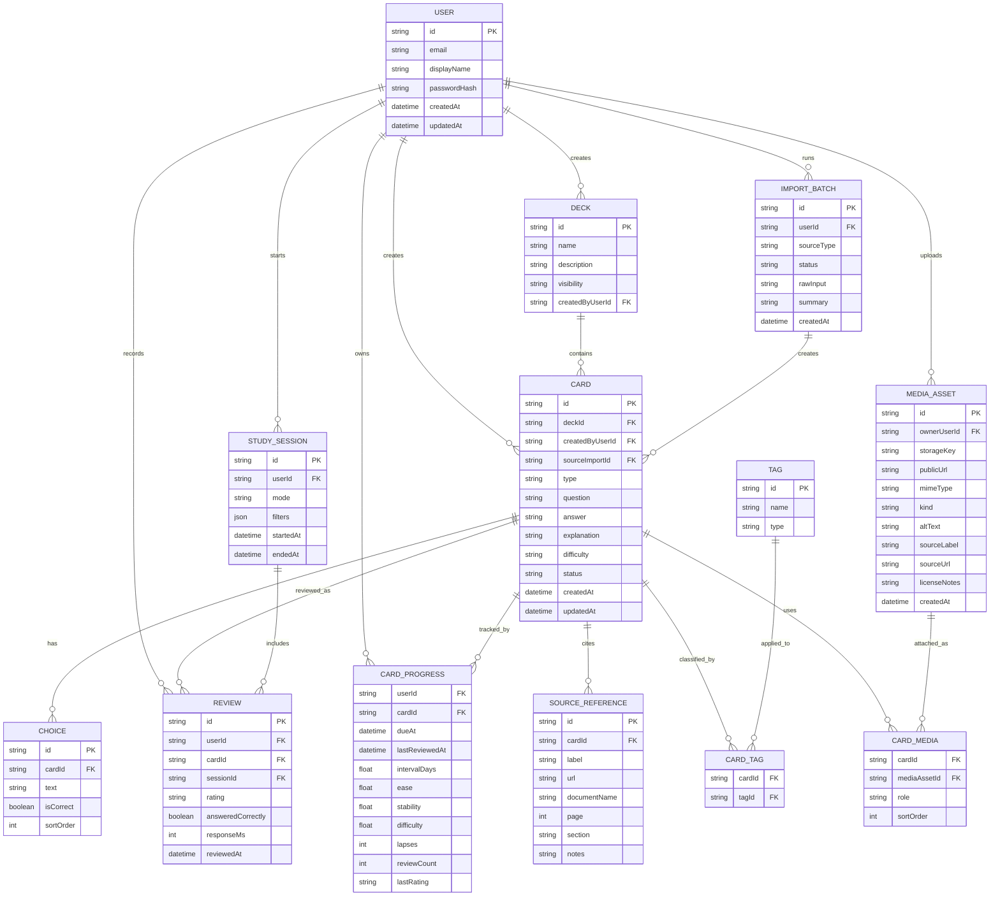

# Core Domain Model

This diagram shows the planned core entities for the PPL flashcard app. It is a conceptual model, not the final Prisma schema, but it should map closely to the database design.

## Relationship Notes

- `CardProgress` is per user and per card. This lets multiple users study the same deck while keeping separate spaced repetition state.
- `Review` is append-only history. The scheduler can be changed later because the raw review events are preserved.
- `Choice` exists only for multiple-choice cards. Open-answer cards do not need choices.
- `Tag` is flexible. Topic, source, skill area, and custom filters all use the same tagging system.
- `MediaAsset` stores file metadata; the actual file should live in object storage or another external file store.
- `SourceReference` is separate from tags so a card can have precise references as well as broad filterable labels.
- `ImportBatch` records how cards entered the system and supports preview, validation, rollback, and later export/debug workflows.

